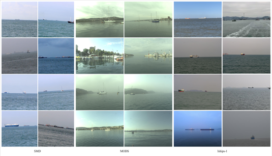
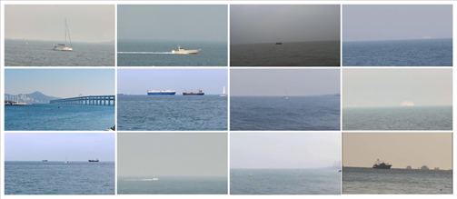
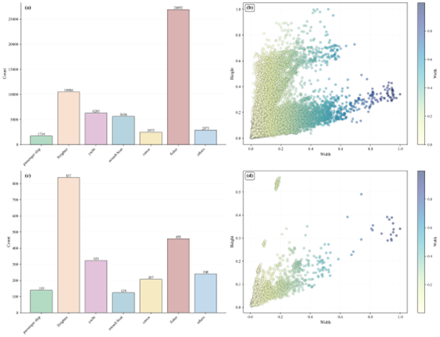

# USMD & UDLM: Maritime Small Object Datasets for USVs

## 1. Overview
This repository provides two maritime small target datasets specifically designed for the **unmanned surface vessel (USV) perspective**, aiming to address the lack of **low-view, high-small-target-ratio** scenarios in existing maritime datasets.

- **USMD (The Small Maritime Datasets for USV)**：Large-scale training and evaluation benchmark datasets built from multiple public datasets
- **UDLM (The Small Maritime Datasets for USV collected in Dalian)**：Data were collected from real-world ocean areas for cross-domain generalization capability assessment.  

Both datasets use a unified 7-class annotation system and YOLO annotation standard to ensure **consistency and fairness of experimental results**.

Dataset address: https://pan.baidu.com/s/1tvtgoDRhKVL2tVCM6xuGCg Extraction code: Please contact us to obtain.


---

## 2. Dataset Description

### 2.1 USMD Dataset
- **Data source**：SMD、MODS、Iships-1 (Unified screening and relabeling)
- **Number of images**：14,350
- **Number of instances**：56,378
- **Data partitioning**：7:2:1（train/val/test）
- **Resolution**：Multi-scale (training is uniformly 640×640)
---

### 2.2 UDLM Dataset
- **Data source**：Data collected in the nearshore waters of Dalian using a self-developed USV platform.
- **Number of images**：1,042
- **Number of instances**：2,328
- **Resolution**：1920×1080

---

### 2.3 Categories

| ID | 0 | 1 | 2 | 3 | 4 | 5 | 6 |
|----|----|----|----|----|----|----|----|
| Category | Passenger ship | Freighter | Yacht | Assault boat | Canoe | Fisher | Others 

---

## 3. Dataset Statistics

### 3.1 USMD Statistics

| Class | Instances | Mean (%) | Median (%) | Q1 (%) | Q3 (%) | Max (%) |
|------|----------|----------|------------|--------|--------|--------|
| Passenger ship | 1734 | 0.58 | 0.08 | 0.03 | 0.34 | 14.30 |
| Freighter | 10486 | 1.60 | 0.61 | 0.15 | 1.71 | 36.28 |
| Yacht | 6285 | 1.59 | 0.49 | 0.12 | 1.85 | 45.26 |
| Assault | 5636 | 0.41 | 0.18 | 0.07 | 0.39 | 11.10 |
| Canoe | 2472 | 3.02 | 1.65 | 0.65 | 3.14 | 40.26 |
| Fisher | 26892 | 1.53 | 0.45 | 0.09 | 1.40 | 52.41 |
| Others | 2873 | 0.09 | 0.01 | 0.01 | 0.05 | 5.70 |
| **Total** | **56378** | **1.40** | **0.38** | **0.08** | **1.36** | **52.41** |

---

### 3.2 UDLM Statistics

| Class          | Instances | Mean (%) | Median (%) | Q1 (%) | Q3 (%) | Max (%) |
|----------------|-----------|----------|------------|--------|--------|---------|
| Passenger ship | 139       | 0.72     | 0.17       | 0.07   | 0.48   | 8.19    |
| Freighter      | 837       | 1.12     | 0.49       | 0.13   | 1.24   | 36.28   |
| Yacht          | 323       | 1.29     | 0.48       | 0.09   | 0.99   | 9.48    |
| Assault boat   | 124       | 0.21     | 0.14       | 0.12   | 0.22   | 1.12    |
| Canoe          | 207       | 5.61     | 2.70       | 1.71   | 4.92   | 36.73   |
| Fisher         | 458       | 2.13     | 0.47       | 0.22   | 2.16   | 13.31   |
| Others         | 240       | 0.11     | 0.07       | 0.03   | 0.14   | 1.24    |
| **Total**      | **2328**  | **1.57** | **0.40**   | **0.11** | **1.29** | **36.73** |

---

## 4. Visualization

### USMD Samples


### UDLM Samples


---

### Statistical Visualization



(a) USMD instance quantity distribution. (b) USMD aspect ratio distribution.  
(c) UDLM instance quantity distribution. (d) UDLM aspect ratio distribution. 

---

## 5. Contact

- **Ning Huang**: funny1201@foxmail.com
- **Affiliation**: Dalian Maritime University


## 6. Citation

If you use this dataset in your research, please cite our paper:

```bibtex
敬请期待
